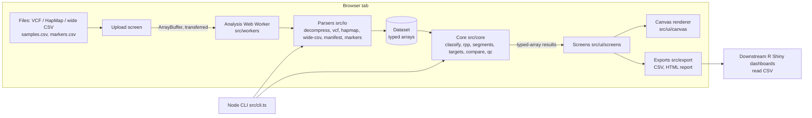

# Isoline Browser: plan

## Problem statement

A public-sector soybean breeding program that finishes backcross-derived near-isogenic lines (NILs, "isolines") needs to confirm, per line, that the donor introgression sits where it was intended, that the rest of the genome is recurrent parent, and that no line is a mislabeled sample, a residual heterozygote, or an outcross. Today this is done by exporting SoySNP50K or SoySNP6K calls into spreadsheets or ad-hoc R scripts, or by installing the desktop Java application Flapjack and reformatting files by hand. The Isoline Browser is a client-only web application that reads the program's genotype files as they are (VCF, HapMap, wide CSV), classifies every call by parent of origin against the recurrent and donor parents, computes recurrent-parent proportion (RPP) with three estimators, calls donor segments, checks user-defined target regions, compares lines pairwise, draws graphical genotypes for all lines on one screen, and exports tables and a self-contained HTML report. Genotype data for unreleased lines never leaves the user's browser tab.

## Users and workflow today vs. target

Users are the breeder and the graduate students who genotype the lines: fluent in R, comfortable with a laptop in a field office, not interested in installing Java or running a server.

Today: SNP calls arrive from the genotyping vendor as VCF or HapMap. Someone writes an R script that recodes calls as A/B/H against the parents, computes a percent recurrent parent, and plots a heatmap; the script is rewritten for each project because file layouts differ. Segment boundaries are read off the heatmap by eye. Reports are assembled by hand in a slide deck.

Target: open the site (GitHub Pages) or a local copy, drop in the genotype file, a samples.csv manifest and an optional markers.csv map, and within seconds see the dataset summary and QC flags, a sortable line table with RPP and segment counts, the graphical genotype of every line across 20 chromosomes, a pairwise comparison view, and one-click exports (per-line CSV, segment CSV, HTML report) whose columns are stable enough to be read by the downstream Shiny dashboards without reshaping. The same compute core runs from the command line for batch runs.

## Scope and non-goals

In scope: parent-of-origin classification; RPP (count-, bp- and cM-weighted) overall and per chromosome; donor/heterozygous segment calling with breakpoint bounds; target-region status and linkage-drag bounds; pairwise line comparison; per-line, per-marker and dataset QC flags; graphical genotype rendering of tens of lines by 50K markers; exports; a Node CLI over the same core.

Non-goals: ranking and selecting among hundreds of segregating progeny per generation (foreground/background selection lists, composite scores) is the sibling progeny-selector project; phenotype or trial analysis; marker design; imputation or genotype error correction (ABHgenotypeR-style correction may be added later as an explicit, logged step); server-side storage of data; mobile layouts.

## Reference projects and what is reused

Details, licences and fetched URLs are in docs/reference-repos.md, including the evaluated-but-not-reused Gigwa2 [web] https://github.com/SouthGreenPlatform/Gigwa2, Germinate [web] https://github.com/germinateplatform/germinate-vue, JBrowse 2 [web] https://github.com/GMOD/jbrowse-components and Breedbase [web] https://github.com/solgenomics/sgn. In brief: the RPP weighting model and linkage-drag definition follow the Flapjack MABC documentation [web] https://flapjack.hutton.ac.uk/en/latest/mabc.html; the canvas-based, retained-mode rendering of graphical genotypes follows flapjack-bytes [web] https://github.com/cropgeeks/flapjack-bytes; the A/B/H coding vocabulary and the "simple genotypes" figure conventions follow ABHgenotypeR [web] https://github.com/StefanReuscher/ABHgenotypeR/ and GenoSee [web] https://github.com/hashimotoshumpei/GenoSee; the identity-by-state definition follows SNPRelate [web] https://rdrr.io/bioc/SNPRelate/man/snpgdsIBS.html; the repository conventions (src/core pure functions, boundary parsers, vitest, ESLint flat config, Prettier) are modelled on flapjack-bytes and scikit-allel's separation of package, docs and tests [web] https://github.com/cggh/scikit-allel. BrAPI's Genotyping module [web] https://github.com/plantbreeding/API is the intended future data source but is not implemented in the scaffold. No code was copied from any reference; all borrowed material is definitions and layout.

## Architecture



The main thread owns React state and the single worker; the worker owns the genotype matrix and never sends it back, only per-line class arrays and summary numbers. File bytes and result arrays cross the boundary as transferable ArrayBuffers, which move ownership instead of copying [web] https://developer.mozilla.org/en-US/docs/Web/API/Web_Workers_API/Using_web_workers. Every function in src/core is pure and runs unchanged in the worker, the main thread, or Node.

Performance plan. At 50K markers × 200 lines the allele arrays are 20 MB and the class arrays 10 MB; classification and RPP are single passes over typed arrays and take well under a second in the worker [inference from the fixture timing; to be measured in M1]. The genotype view bins markers per pixel column, so draw cost is proportional to pixels, not markers. For 1,000+ lines the class arrays reach 50 MB per 50K markers, still acceptable; the line table and renderer then virtualise rows (only visible lines are drawn) and per-line segment calling runs lazily on selection. For 500K+ markers (GBS), the plan is a streaming parser that reads the file in chunks and keeps only the two allele arrays (1 GB at 1,000 lines, which exceeds practical browser memory), so the M3 loader will additionally support pre-filtering to informative markers during parsing (parents are known from the manifest) and documenting `bcftools view -R` region subsetting; beyond that the CLI is the intended path.

## Data model and file contracts

The in-memory model (src/core/types.ts) stores calls as two unordered allele-index arrays (`allele1 <= allele2`, 255 = missing) indexing a per-marker allele table, so VCF GT indices, HapMap nucleotides and A/B/H codes all map to the same structure at two bytes per call (docs/adr/0005). A Dataset carries markers (id, normalised chromosome, bp, optional cM, alleles), the genotype matrix, the sample manifest, parent column indices, chromosome display order and a sorted marker order. Classification produces one Uint8Array of call classes per candidate (MISSING 0, RP_HOM 1, DONOR_HOM 2, HET 3, UNINFORMATIVE 4, NONPARENTAL 5); every downstream metric reads classes, never raw alleles.

Input files follow the contract shared with progeny-selector: VCF 4.2+ (plain or bgzip), HapMap, or a wide CSV with columns marker_id, chrom, pos_bp and one column per sample (nucleotide or A/B/H calls); samples.csv with sample_id, line_name, role, generation, family_id, notes and exactly one recurrent_parent and one donor_parent; optional markers.csv with marker_id, chrom, pos_bp, cm. Chromosome names Gm01–Gm20, chr1–chr20 and 1–20 are accepted and normalised. Column tables, examples and the output CSV schemas are in docs/data-formats.md.

## Core algorithms and metrics

1. Parent-of-origin classification (src/core/classify.ts). A marker is informative when both parents are called, both homozygous, and their alleles differ; otherwise every candidate is UNINFORMATIVE there. At an informative marker a candidate call is RP_HOM (both alleles equal the recurrent-parent allele), DONOR_HOM, HET (one of each), MISSING, or NONPARENTAL (any allele found in neither parent). Coded A/B/H input defines allele 0 = recurrent, 1 = donor at every marker so parents need not be present. This definition is identical to the sibling project's so class-level outputs can be exchanged.

2. Recurrent-parent proportion (src/core/rpp.ts). With s = 1 for RP_HOM, 0.5 for HET, 0 for DONOR_HOM over informative markers with a parental call: rpp_count = Σs / n_called; rpp_bp = Σ w_i s_i / Σ w_i with w_i = min(d_left/2, c/2) + min(d_right/2, c/2), d the distance to the neighbouring called marker and c the "maximum marker coverage" (default 2 Mb; chromosome ends use the distance to the end when a length is known, else c/2); rpp_cm uses the same weights on genetic positions (default c = 10 cM) and is NaN without a map. MISSING, NONPARENTAL and UNINFORMATIVE markers leave both sums, which equals imputing the line's own mean [inference]. The weighted form is Flapjack's MABC model [web] https://flapjack.hutton.ac.uk/en/latest/mabc.html. Context values shown next to observed RPP: expected RPP after n backcrosses without selection is 1 − (1/2)^(n+1) (BC1 0.75, BC2 0.875, BC3 0.9375, BC5 0.984) [web] https://iastate.pressbooks.pub/molecularplantbreeding/chapter/marker-assisted-backcrossing/; the theory of marker-assisted background selection and its effect on carrier-chromosome recovery is from Hospital and Charcosset 1997, Genetics 147:1469–1485, DOI 10.1093/genetics/147.3.1469 [web] https://academic.oup.com/genetics/article-abstract/147/3/1469/6054126; selection-strategy comparisons from Frisch, Bohn and Melchinger 1999, Crop Science 39:1295–1301, DOI 10.2135/cropsci1999.3951295x [web] https://experts.illinois.edu/en/publications/comparison-of-selection-strategies-for-marker-assisted-backcrossi/; the selection-theory extension from Frisch and Melchinger 2005, Genetics 170:909–917, DOI 10.1534/genetics.104.035451 [web] https://academic.oup.com/genetics/article-abstract/170/2/909/6059341. Finished isolines are typically BC5F3 or later, so observed RPP below about 0.95 with a large donor segment count is a flag rather than an expectation.

3. Donor segment calling (src/core/segments.ts). Walk informative markers on each chromosome in position order; MISSING and NONPARENTAL calls neither extend nor break a run but count towards `maxMissingSpan`. A run is a maximal sequence of non-RP calls, split when two consecutive informative markers are farther apart than `maxSegmentGapCm` (10 cM, when markers.csv supplies a map) or `maxSegmentGapBp` (10 Mb, otherwise), the PLINK `--homozyg-gap` convention of a distance between consecutive markers rather than between consecutive calls, or when more than `maxMissingSpan` skipped markers lie between two non-RP calls (docs/adr/0008; the run gap is deliberately not the RPP coverage cap). Runs with fewer than `minMarkers` non-RP calls are dropped unless the UI asks for them (suspected errors). startBp/endBp are the outermost non-RP markers; leftFlankBp/rightFlankBp are the nearest RP_HOM markers outside the run (NaN at chromosome ends), so the breakpoint lies in (leftFlank, start] and [end, rightFlank). Class is donor, het, or mixed.

4. Target-region status and linkage drag (src/core/targets.ts). A region is chrom:start-end (a marker is start = end). Informative called markers inside the region give status donor, het, rp, recombinant (any mixture, including donor with het), or no_data. The segment with the largest overlap gives, per side of the region, dragMinBp (distance from the region edge to the segment's outermost non-RP marker) and dragMaxBp (distance to the flanking RP marker), each clipped at 0 and summed over both sides; inside a segment this is segment length − region length and flank span − region length; dragMaxBp is NaN when a flank is missing. The flank form matches Flapjack's "distance to the first recombination on each side" [web] https://flapjack.hutton.ac.uk/en/latest/mabc.html.

5. Pairwise comparison (src/core/compare.ts; stub until M2). Mode informative compares classes at informative markers called in both lines; mode all compares unordered allele pairs at every marker called in both, which surfaces residual heterozygosity and genotyping error outside introgressions. Output: counts overall and per chromosome plus discordant marker indices in genome order. Identity by state between lines, when shown, is the mean over co-called markers of shared alleles / 2, the SNPRelate definition [web] https://rdrr.io/bioc/SNPRelate/man/snpgdsIBS.html.

6. Quality control (src/core/qc.ts). Per line: missing rate over all markers, heterozygous rate over called markers, nonparental rate over informative called markers; flags high_missing, high_het, nonparental_alleles (any nonparental call), closer_to_donor (rpp_count < 0.5: swapped sample or swapped parents), identical_to_rp (no donor, heterozygous or nonparental call; no minimum-n guard), no_informative_calls (RPP undefined). Per marker: call rate, lowCallRate. Parents: parent_heterozygous above `parentHetMax` (inbred soybean parents should be near 0). Dataset: parents_identical when the polymorphism rate is below 0.01, low_marker_call_rate when more than a tenth of markers fall below `markerCallRateMin`. Thresholds come from .env.example and are editable per session.

Edge cases across all algorithms: heterozygous parent calls make a marker uninformative rather than guessing; multiallelic markers are handled by allele index; a line with zero called informative markers has NaN RPP and is flagged; generation strings are display-only in this project (expected values are looked up from the BC count when the string parses).

## UI walkthrough

Screen 1 Upload: three file pickers (genotypes, samples.csv, optional markers.csv), parameter panel seeded from config, Load button; parser errors verbatim; warnings list; then automatic navigation to Summary. Screen 2 Summary and QC: counts by role, informative-marker count, parent polymorphism rate, per-line QC table with flags, call-rate histogram, dataset flags; lines flagged closer_to_donor are highlighted. Screen 3 Lines: one row per candidate with rpp_count/bp/cm, segment count, largest segment, target status per region, QC flags; sortable; multi-select feeds the next screens. Screen 4 Graphical genotypes: canvas with 20 chromosome tracks per line, one row per line, Okabe-Ito class colours, zoom by drag or typed region ("Gm13:28.5-29.1Mb"), hover detail, target overlays. Screen 5 Compare: two samples, mode toggle, discordant counts overall and per chromosome, discordant marker list, both lines stacked with discordant positions marked. Screen 6 Export: per-line CSV, segments CSV, target CSV, HTML report; PDF via the browser print dialog. Navigation is a button bar with aria-current; every control is reachable by keyboard; colours are never the only carrier of meaning (class labels appear in tooltips and tables).

## Technology decisions

Client-only TypeScript with Vite, React 19 for the shell, a Web Worker for parsing and computation, HTML canvas for rendering, fflate for gzip, vitest/ESLint/Prettier for quality (docs/adr/0001). Input formats and the manifest are the shared contract (0002). Hosting is static on GitHub Pages with a configurable base path, or any static server inside the university network (0003). MIT licence (0004). Genotype storage as two Uint8Array allele indices (0005). RPP estimators and Flapjack weighting (0006). Rendering strategy for 50K markers (0007). Donor-run gap criterion, decoupled from the RPP cap (0008).

## Repository layout

```
isoline-browser/
├── PLAN.md                      this document
├── README.md                    what it does, quickstart, status
├── CHANGELOG.md                 Keep a Changelog, 0.1.0 unreleased
├── CONTRIBUTING.md              conventions: Conventional Commits, SemVer, MADR
├── LICENSE                      MIT
├── package.json / package-lock.json
├── tsconfig.json                strict TS, erasableSyntaxOnly (Node can run .ts directly)
├── vite.config.ts               base path from VITE_BASE_PATH; vitest config
├── eslint.config.js / .prettierrc.json / .prettierignore / .editorconfig
├── .env.example                 twelve-factor build-time config
├── .gitignore                   node_modules, dist, user genotype files
├── index.html                   Vite entry
├── .github/workflows/ci.yml     lint, typecheck, test, build; Pages deploy on main
├── docs/
│   ├── data-formats.md          input and output file contracts
│   ├── reference-repos.md       fetched repositories, licences, what was borrowed
│   └── adr/0001..0008-*.md      MADR decisions
├── scripts/make-fixture.mjs     deterministic synthetic fixture generator
├── src/
│   ├── main.tsx / App.tsx       React entry and six-screen shell
│   ├── config.ts                the only reader of import.meta.env
│   ├── cli.ts                   node src/cli.ts summarize ...
│   ├── core/                    pure: types, chromosomes, classify, rpp, segments, targets, compare, qc, palette
│   ├── io/                      boundary: csv, decompress, vcf, hapmap, wide-csv, manifest, markers, builder, loaders
│   ├── workers/                 protocol.ts, analysis.worker.ts
│   ├── export/                  summary-csv, segments-csv, report
│   └── ui/                      screens/*.tsx, canvas/GraphicalGenotypeRenderer.ts
└── tests/
    ├── helpers.ts, smoke/contracts/qc/segments/targets/fixture-*.test.ts
    └── fixtures/synthetic/      genotypes.vcf, .hmp.txt, _wide.csv, _coded.csv, samples.csv, markers.csv, expected.json
```

## Testing and CI

Unit and smoke tests run under vitest in Node (no browser needed): tests/smoke.test.ts parses the synthetic fixture in all four formats (VCF, gzipped VCF, HapMap, wide nucleotide and coded CSV), classifies six planted NILs and checks class counts and count-, bp- and cM-weighted RPP against expected.json to 12 decimal places; tests/contracts.test.ts covers manifest rules, chromosome normalisation, delimited-text parsing and VCF edge cases; tests/segments.test.ts, tests/targets.test.ts and tests/qc.test.ts are hand-built edge cases; tests/fixture-segments.test.ts and tests/fixture-targets.test.ts check the fixture against expected.json, whose segments come from a second implementation of the rule inside the generator (docs/adr/0008). The fixture is regenerated by `npm run fixture` from a seeded generator whose expected values are computed with an independent, simpler implementation of the same formulas. CI (.github/workflows/ci.yml) runs `npm ci`, `npm run lint`, `npm run typecheck`, `npm test`, `npm run build` on Node 22 for every push and pull request, regenerates the fixture and fails if it differs from the committed files, and deploys the build to GitHub Pages on pushes to main when Pages is enabled. Later milestones add a browser-mode vitest run for the canvas renderer and a Playwright smoke run of the six screens.

## Deployment and cost

Static files only. `npm run build` with `VITE_BASE_PATH=/isoline-browser/` produces dist/ for a GitHub Pages project site at zero cost; the same dist/ can be copied to any static web server inside the university network or opened from a USB stick with `npm run preview`. No server process, no database, no telemetry; files are read with the File API and processed in a Web Worker in the tab. The only recurring cost is CI minutes on a public repository, which GitHub provides free.

## Milestones

M0 scaffold (complete): repository layout, parsers for all input formats, manifest and marker-map validation, classification, RPP with three estimators, per-line summary CSV, CLI summarize, synthetic fixture and smoke tests, lint/typecheck/CI, this plan and ADRs. Acceptance: `npm run lint`, `npm run typecheck`, `npm test`, `npm run build` all pass; the CLI reproduces expected.json on the fixture.

M1 vertical slice (complete, 2026-09-06): segments.ts, targets.ts, qc.ts and the worker handlers implemented; Upload, Summary and Lines screens functional; canvas renderer draws all lines with binning. Acceptance as measured: a 50K-marker VCF with 24 lines runs parse, classification, RPP, segment calling for every line and QC in 1.2 s in Node on the development laptop (parsing is 0.75 s of that; the worker runs the same code and was not timed separately, so the under-10 s target holds with an order of magnitude to spare); planted segments in the fixture are called with exact start, end and flank positions under both gap criteria of docs/adr/0008 (tests/fixture-segments.test.ts, against expectations from a second implementation in the generator); QC flags on NIL_03, NIL_05 and NIL_06 match their planted design (tests/qc.test.ts). The segment-gap rule was corrected before implementation: see docs/adr/0008.

M2 usable: Genotype view zoom and hover, Compare screen, Export screen with HTML report and all CSVs; keyboard navigation across screens; parameter editing after load without re-parsing. Acceptance: a breeder can go from files to an archived report without leaving the browser; exported CSVs open in R with `readr::read_csv` and the documented column names.

M3 hardened: streaming parse of bgzipped VCF in the worker to keep memory under twice the file size; BrAPI allele-matrix loader; browser-mode tests for the renderer; accessibility review (focus order, contrast, non-colour cues); versioned data-contract document shared with progeny-selector. Acceptance: 50K × 200 lines under 30 s; Lighthouse accessibility score above 90; contract tests shared with the sibling repository pass on both.

## Risks and open questions

Memory in the browser for very large VCFs (50K markers × hundreds of lines is small, but a 1M-site GBS VCF is not): mitigated by streaming parse in M3 and by documenting `bcftools view -R` pre-filtering. Non-uniform marker density on SoySNP50K heterochromatic regions biases count-based RPP; the bp-weighted estimator with a coverage cap is the default for display. Whether the program's isolines have a reliable cM map (BARCSoySNP6K positions are on Wm82.a2.v1 [web] https://digitalcommons.unl.edu/cgi/viewcontent.cgi?article=2402&context=agronomyfacpub; SoySNP50K on Glyma1.01 [web] https://journals.plos.org/plosone/article?id=10.1371/journal.pone.0054985) is open; markers.csv exists so the user supplies positions on one assembly. Open questions for the user: which assembly the program's positions use (Wm82.a2.v1, a4.v1, or the newer a6 [web] https://www.biorxiv.org/content/10.1101/2024.04.26.591401v1); whether a second donor (pyramided lines) must be supported in the first release; whether the HTML report needs the program's template; and whether the GitHub Pages site should be public or the app only run locally.

## Assumptions

Parents are inbred and homozygous at nearly all markers; the genotype file contains both parents unless the input is A/B/H-coded; at most one donor per analysis set; positions in the genotype file and markers.csv are on the same assembly, or markers.csv overrides them; users have a laptop with a current Chromium or Firefox browser; the sibling projects keep the samples.csv and wide-CSV contracts unchanged.

## Verification status

Run on 2026-09-04 in the scaffold container (Node v22.22.2, npm 10). All commands executed from the repository root.

```
$ npm test
 Test Files  2 passed (2)
      Tests  20 passed (20)

$ npm run typecheck
> tsc --noEmit
(no output; exit 0)

$ npm run lint
> eslint . && prettier --check .
Checking formatting...
All matched files use Prettier code style!

$ npm run build
✓ 26 modules transformed.
dist/index.html                  0.34 kB │ gzip:  0.24 kB
dist/assets/index-Ddk27ieq.js  193.50 kB │ gzip: 61.12 kB │ map: 871.07 kB
✓ built in 507ms

$ node src/cli.ts summarize --genotypes tests/fixtures/synthetic/genotypes.vcf \
    --samples tests/fixtures/synthetic/samples.csv --markers tests/fixtures/synthetic/markers.csv | head -2
sample_id,n_informative,n_called,n_rp_hom,n_donor_hom,n_het,n_missing,n_nonparental,rpp_count,rpp_bp,rpp_cm,rpp_count_Gm01,...
NIL_01,460,457,453,4,0,3,0,0.991247,0.991170,0.991203,1.000000,...
```

Re-run at the end of the session after the documentation edits (same container, same versions):

```
$ npm run lint
> eslint . && prettier --check .
Checking formatting...
All matched files use Prettier code style!
(exit 0)

$ npm test
 Test Files  2 passed (2)
      Tests  20 passed (20)

$ npm run typecheck
> tsc --noEmit
(exit 0)

$ npm run build
✓ 26 modules transformed.
dist/index.html                  0.34 kB │ gzip:  0.24 kB
dist/assets/index-Ddk27ieq.js  193.50 kB │ gzip: 61.12 kB │ map: 871.07 kB
✓ built in 436ms

$ npm run fixture; md5sum -c before.md5      # all 8 fixture files reported OK (generator is deterministic)

$ find . -type f -not -path "./node_modules/*" | wc -l
75
$ du -sh --exclude=node_modules .
648K
```

Largest file is package-lock.json (87 KB); the fixture directory is 143,376 bytes across seven data files and a README. dist/ and node_modules/ were removed after verification and are ignored by git. Every URL cited in PLAN.md, README.md, CONTRIBUTING.md, CHANGELOG.md and docs/ was fetched on 2026-09-04 and resolved; the two exceptions are recorded inline (the Wiley page for the Wm82.a6 paper returned 403, so the bioRxiv preprint is cited; the SoyBase SoySNP50K tool page returned 403, so the PLOS ONE paper is cited for platform facts).

Before the first run, `npm run typecheck` reported six errors (two possibly-undefined index accesses in src/core/rpp.ts and four constructor parameter properties disallowed by `erasableSyntaxOnly` in src/io/builder.ts and src/ui/canvas/GraphicalGenotypeRenderer.ts) and `npm run lint` failed because `@eslint/js` was imported by eslint.config.js but not declared; these were fixed (explicit field assignments, `@eslint/js` added to devDependencies, one unused variable and a BOM regex literal cleaned up, Prettier applied). Not verified: the React screens in a browser (placeholders only), the Web Worker path (handlers are stubs), and GitHub Pages deployment (requires a repository with Pages enabled). File count and size, excluding node_modules and dist: recorded in the final report.

### M1 run, 2026-09-06

Development laptop, Windows 11, Node v24.13.1, npm 11.8.0 (CI runs Node 22). Commands from the repository root after commit `refactor(core): name the donor-run gap fields`.

```
$ npm run lint
> eslint . && prettier --check .
Checking formatting...
All matched files use Prettier code style!

$ npm run typecheck
> tsc --noEmit
(exit 0)

$ npm test
 Test Files  8 passed (8)
      Tests  139 passed (139)

$ npm run build
dist/assets/analysis.worker-*.js   30.24 kB
dist/assets/index-*.js            213.38 kB │ gzip: 67.39 kB
✓ built

$ npm run fixture; md5sum -c before.md5     # all files OK: the generator is deterministic

$ node src/cli.ts segments --genotypes tests/fixtures/synthetic/genotypes.vcf     --samples tests/fixtures/synthetic/samples.csv --markers tests/fixtures/synthetic/markers.csv | head -2
segment gap criterion: cm (10 cM)
sample_id,chrom,start_bp,end_bp,left_flank_bp,right_flank_bp,n_markers,n_donor_hom,n_het,class,start_cm,end_cm,length_bp,length_cm,gap_criterion
NIL_01,Gm13,21000000,27000000,17000000,29000000,4,4,0,donor,50.400000,64.800000,6000000,14.400000,cm
```

Timing on a generated 50,000-marker VCF with 2 parents and 24 lines (7.1 MB; a throwaway script, not committed): parse 753 ms, assemble 87 ms, classify 40 ms, RPP 189 ms, segments for 24 lines 91 ms, QC 59 ms; 1.22 s in total, 66 MB heap.

Verified in a Chromium-based browser against the synthetic fixture through the real load path (the three files handed to the file inputs as File objects): the worker parsed and classified, the app moved to Summary with focus on its heading, the Summary values equalled the test expectations (500 markers, 460 informative, parent polymorphism 0.939, NIL_03 nonparental_alleles, NIL_05 closer_to_donor, NIL_06 high_missing), the Lines table sorted with aria-sort and showed one status column per target region including two regions with the same name, a bad region spec appeared verbatim in the alert without disturbing the table, and the canvas drew six rows by twenty tracks in the Okabe-Ito class colours with no console errors. Not verified: a real SoySNP50K or 6K file; Firefox; the renderer under browser-mode tests (M3); GitHub Pages deployment.

Two adversarial reviews preceded the two M1 commits; what they found and what changed is recorded in the commit messages (`git log`). Findings deferred to M2: a child_process smoke test for the CLI, a minimum-n note for identical_to_rp in the report, and a warning when a typed region names a chromosome absent from the dataset.
